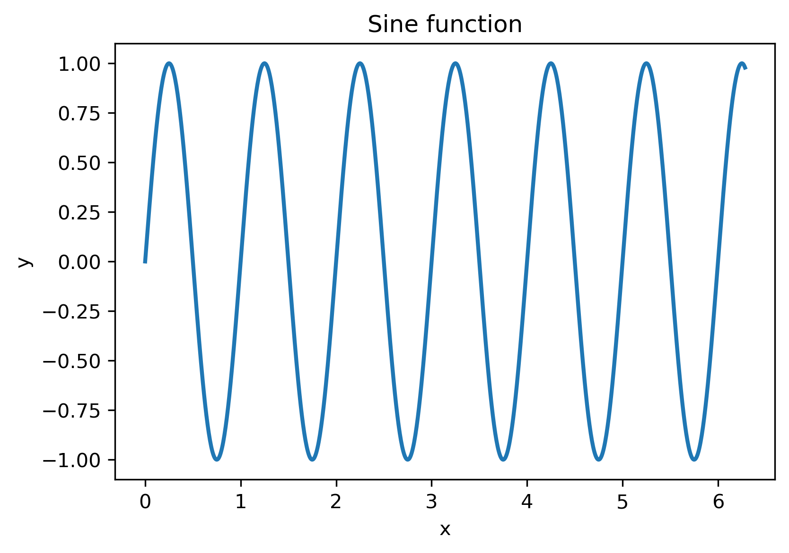

# RSAA HPC Skillshare -- PBS Tutorial

This repository contains example **PBS job scripts** and **Python
programs** used in the RSAA HPC Skillshare tutorial.

You can find Mark Krumholz's Introductory slides [here](https://github.com/svenbuder/rsaa_skillshare/blob/main/2026-03-supercomputing/rsaa-skillshare-supercomputing-slides.pdf)

## 1 SSH onto mozzie and clone the repository

SSH onto our RSAA HPC cluster mozzie (historically called avatar)

``` bash
ssh -Y MSO_USERNAME@mozzie.anu.edu.au
```

Clone the repository and list its content

``` bash
git clone https://github.com/svenbuder/rsaa_hpc_tutorial.git
cd rsaa_hpc_tutorial
ls
```

You should see the following repository structure:

    rsaa_hpc
    ├── code/       Python scripts executed by the jobs
    ├── logs/       PBS logs
    ├── output/     Output created by the jobs
    └── *.pbs       PBS job submission scripts

## 2 Submitting jobs

Example:

``` bash
qsub pbs_job_name.pbs
```

Check jobs:

``` bash
qstat
```

Cancel a job:

``` bash
qdel JOBID
```

### 2.1 Example 1 -- A job that works (but should not be used)

    qsub pbs_0_minimal.pbs

Runs the following `code/hello_world.py`:

```python
import time

print("Hello from the HPC cluster!")

for i in range(5):
    print(f"Step {i}")
    time.sleep(2)

print("Done")
```

The following logs appear in `logs/`:

    logs/
    ├── *.OU    Output logs (what would be printed to screen)
    └── *.ER    Error logs (here: I purposefully forgot an `echo`)

While this job runs, I would not use it. There some things one should fix or add to a job submission file.

### 2.2 Example 2 --- Single CPU job with output

Submit the job:

    qsub pbs_2_single_cpu.pbs

This example runs a slightly more realistic batch job.\
In addition to writing log messages, it produces scientific output
files when executing `code/sine_function.py`.

#### PBS script

``` bash
#!/bin/bash
#PBS -N 2_single_cpu
#PBS -l select=1:ncpus=1
# Each node has 28 CPUs
#PBS -q small
# Options for -q on mozzie include: small, large
#PBS -o logs/
#PBS -e logs/
#PBS -m ae

cd "$PBS_O_WORKDIR"

echo "Running on:"
hostname
echo "Working directory:"
pwd
echo "Job ID:"
echo "$PBS_JOBID"

python code/sine_function.py

echo "Job finished successfully."
```

#### Changes compared to Example 1

The PBS script is mostly the same as before, but now:

-   We submit the job to one of the more numerous `small` memory nodes
-   Email notifications are enabled (`#PBS -m ae`)
-   The job runs a Python script that produces a `pdf` and `png` file showing a sine-function as well as a `txt` file that has the `amplitude`, `frequency`, `phase`, and `offset` of the function.
-   These output files are saved in the `output/` directory to keep projects organised and makes it easier to find results from many jobs.




### 2.3 Example 3 -- Multi‑CPU job

    qsub pbs_3_threaded_4cpu.pbs

Requests **4 CPUs** and runs a multiprocessing Python script.


### 2.4 Example 4 -- Job array

    qsub pbs_4_job_array.pbs

Launches **3 jobs simultaneously**.

Each job writes results to:

    output/

### 2.5 Example 5 -- Jupyter notebook on a compute node

    qsub pbs_5_jupyter_notebook.pbs

Then connect with SSH tunnelling from your computer:

``` bash
ssh -L 8888:localhost:8888 USERNAME@mozzie.anu.edu.au
```

Open:

    http://localhost:8888


## Important PBS variable

All scripts contain:

    cd $PBS_O_WORKDIR

This ensures the job runs from the submission directory.
