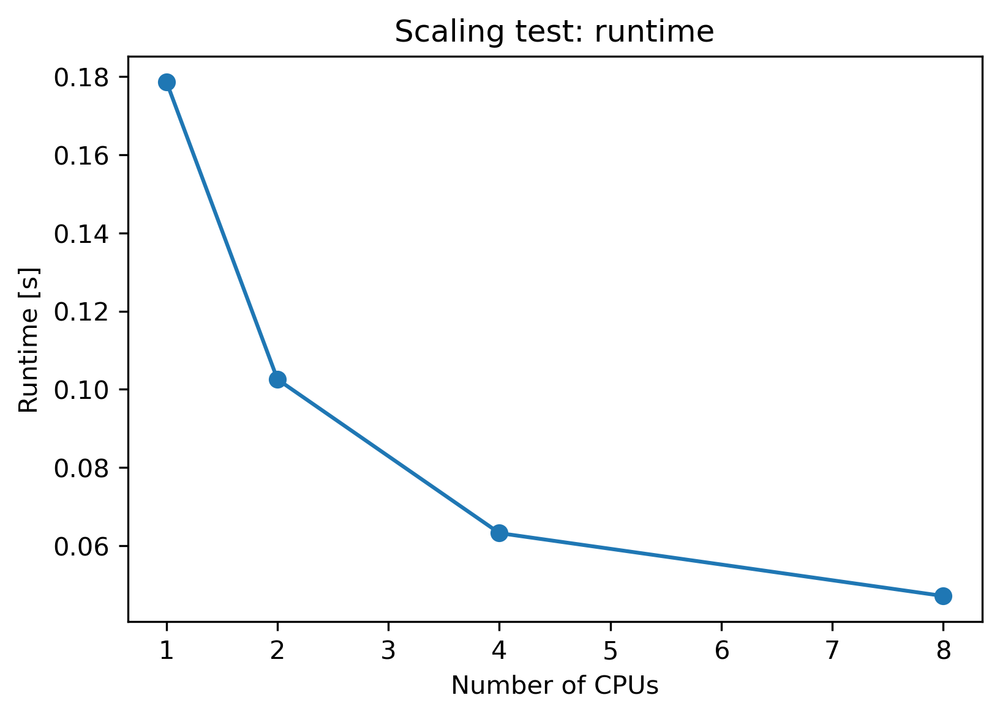
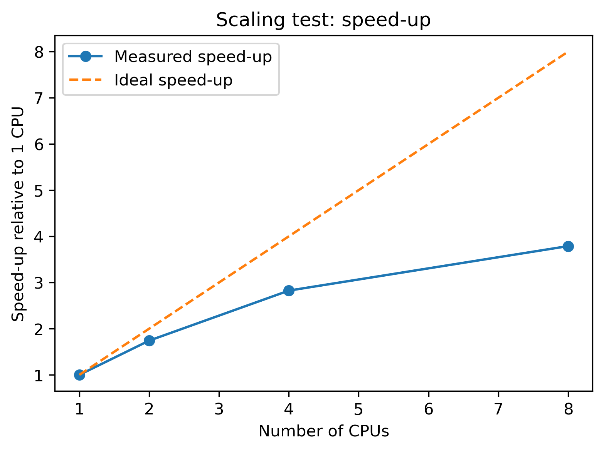

# RSAA HPC Skillshare -- PBS Tutorial

This repository contains example **PBS job scripts** and **Python
programs** used in the RSAA HPC Skillshare tutorial.

You can find Mark Krumholz's Introductory slides [here](https://github.com/svenbuder/rsaa_skillshare/blob/main/2026-03-supercomputing/rsaa-skillshare-supercomputing-slides.pdf)

## 1 SSH onto mozzie and clone the repository

SSH onto our RSAA HPC cluster mozzie (historically called avatar)

``` bash
ssh -Y MSO_USERNAME@mozzie.anu.edu.au
```

Clone the repository and list its content

``` bash
git clone https://github.com/svenbuder/rsaa_hpc_tutorial.git
cd rsaa_hpc_tutorial
ls
```

You should see the following repository structure:

    rsaa_hpc
    ├── code/       Python scripts executed by the jobs
    ├── logs/       PBS logs
    ├── output/     Output created by the jobs
    └── *.pbs       PBS job submission scripts

## 2 Submitting jobs

Example:

``` bash
qsub pbs_job_name.pbs
```

Check jobs:

``` bash
qstat
```

Cancel a job:

``` bash
qdel JOBID
```

### 2.1 Example 1 -- A job that works (but should not be used)

    qsub pbs_0_minimal.pbs

Runs the following `code/hello_world.py`:

```python
import time

print("Hello from the HPC cluster!")

for i in range(5):
    print(f"Step {i}")
    time.sleep(2)

print("Done")
```

The following logs appear in `logs/`:

    logs/
    ├── *.OU    Output logs (what would be printed to screen)
    └── *.ER    Error logs (here: I purposefully forgot an `echo`)

While this job runs, I would not use it. There some things one should fix or add to a job submission file.

### 2.2 Example 2 --- Single CPU job with output

Submit the job:

    qsub pbs_2_single_cpu.pbs

This example runs a slightly more realistic batch job.\
In addition to writing log messages, it produces scientific output
files when executing `code/sine_function.py`.

#### PBS script

``` bash
#!/bin/bash
#PBS -N 2_single_cpu
#PBS -l select=1:ncpus=1
# Each node has 28 CPUs
#PBS -q small
# Options for -q on mozzie include: small, large
#PBS -o logs/
#PBS -e logs/
#PBS -m ae

cd "$PBS_O_WORKDIR"

echo "Running on:"
hostname
echo "Working directory:"
pwd
echo "Job ID:"
echo "$PBS_JOBID"

python code/sine_function.py

echo "Job finished successfully."
```

#### Changes compared to Example 1

The PBS script is mostly the same as before, but now:

-   We submit the job to one of the more numerous `small` memory nodes
-   Email notifications are enabled (`#PBS -m ae`)
-   The job runs a Python script that produces a `pdf` and `png` file showing a sine-function as well as a `txt` file that has the `amplitude`, `frequency`, `phase`, and `offset` of the function.
-   These output files are saved in the `output/` directory to keep projects organised and makes it easier to find results from many jobs.

<p align="center"> </p>

### 2.3 Example 3 -- Threaded job with multiple CPUs

Submit the job:

```bash
qsub pbs_3_multiple_cpu.pbs
```

This example requests **4 CPUs** and uses Python multiprocessing to split a simple numerical task across several worker processes.

#### What changes compared to Example 2?

- the job now requests more than one CPU
- the Python script uses multiple worker processes
- the output still goes into `output/`
- this is an example of **shared-memory parallelism on one node**

#### PBS script

```bash
...
#PBS -l select=1:ncpus=4

SNCPUS=$(wc -l < "$PBS_NODEFILE")
echo "Allocated CPUs:"
echo "$NCPUS"
# On some HPCs, you could also use $PBS_NCPUS

python code/sine_multiprocessing.py "$NCPUS"
...
```

#### What the Python code does

This creates a list of independent tasks, distributes them across the requested CPUs and gathers the results.

```python
import sys
from multiprocessing import Pool

# Nr of CPUs handed down from PBS script
ncpu = int(sys.argv[1])

def evaluate_task(task):
    """
    Function to evaluate a specific task
    """

# A number of tasks, e.g. 10 parameter values
tasks = np.arange(10)

# Pool 10 tasks across ncpu
with Pool(processes=ncpu) as pool:
    results = pool.map(evaluate_task, tasks)
```

Note: Some `python` packages are already written to parallelise, but requesting multiple CPUs only helps if the code is actually written to use them.

#### For more complex parallel workloads

The threaded example above uses Python’s `multiprocessing` module to run several worker processes on a single node. This is often the simplest way to parallelise Python code.

However, HPC systems support several different parallel computing patterns depending on the type of problem and also your choice of programming language.

| Situation | Typical approach | Example tools |
|-----------|------------------|---------------|
| One task split across several CPUs on **one node** | Shared-memory parallelism | Python `multiprocessing`, OpenMP |
| One task distributed across **many nodes** | Message Passing Interface (MPI) | e.g. OpenMPI, `mpi4py` |
| Many **independent tasks** | Job arrays (scheduler parallelism) | PBS job arrays (`#PBS -J`) |
| Large Python data workflows | Task-based parallel frameworks | `dask`, `joblib` |

In practice, job arrays and simple multiprocessing cover many everyday HPC workloads. More complex simulations often rely on MPI-based codes written in C, C++, Fortran, or Python (`mpi4py`). **Discuss options with your supervisor or colleagues at the institute**, who may already have experience or existing tools for similar problems.

### 2.4 Example 4 -- Job array

This example demonstrates how many related jobs can be submitted with one `qsub` command:

```bash
qsub pbs_4_job_array.pbs
```

This example launches a **job array**.  
Each array task gets a different value of `PBS_ARRAY_INDEX` and creates a slightly different sine function.

```bash
...
#PBS -l select=1:ncpus=1
#PBS -J 1-5
# This will launch an array of 5 jobs each with 1 CPU.
...
```

#### Why job arrays are useful

Job arrays are ideal when you want to run many similar jobs, for example:

- scanning different parameters
- processing many input files
- repeating simulations with different seeds

### 2.5 Example 5 -- Interactive Jupyter notebook

Submit an interactive job within a screen (a virtual screen that will stay open even if you loose internet access):

```bash
screen -S jupyter_session
qsub -I -q small -l select=1:ncpus=2 -N jupyter
```

This will submit your interactive job to one of the compute nodes, e.g. `m16`. Note that you might need more than `ncpus=1`. In the same bash, now start `jupyter` with a (hopefully) unique port (so not `12345` as in this example)::

```bash
cd rsaa_hpc_tutorial/
jupyter notebook --no-browser --ip=0.0.0.0 --port=12345
```

This starts a Jupyter notebook server on a compute node and will print output containing a token, for example:

`[some green text] http://localhost:12345/tree?token=...`

Leave this terminal running. To detach from the `screen` session without stopping Jupyter, press `Ctrl+A` followed by `D`. To reconnect later, run `screen -r jupyter_session`.

Open a new terminal on your local machine and run, where you exchange `m16` with the node your job runs on and `12345` with the port you have chosen:

```bash
ssh -L 12345:m16:12345 USERNAME@mozzie.anu.edu.au
```

Then in your browser open:

```text
http://localhost:12345
```

This usually will ask you for a `token`. Simply copy and paste the characters after `http://localhost:12345/tree?token=` of the `screen` terminal.

The main lesson is that the notebook runs on the compute node, not on the login node.

Note that the way you have to start `jupyter` on HPCs may differ (for some HPCs, you can for example use `ssh -L 12345:localhost:12345` instead of the compute node name).

### 2.6 Example 6 -- Small scaling test

Submit the job:

```bash
qsub pbs_6_scaling_test.pbs
```

This job requests 8 CPUs and then measures how the runtime changes when using 1, 2, 4, and 8 processes.

The code estimates the value of π using a simple Monte Carlo experiment. It samples 8,000,000 random points in the unit square and checks which points fall inside a quarter circle of radius 1:
```
x * x + y * y <= 1.0
```

The fraction of points inside the quarter circle gives an estimate of π:

```
π ≈ 4 × (points inside circle) / (total points)
```

The total number of samples is kept fixed, but the work is split across different numbers of worker processes. This allows us to measure how efficiently the program uses additional CPUs.

In a perfect world, doubling the number of CPUs would halve the runtime. In practice, process startup, scheduling, and communication overheads mean that scaling is usually less than ideal. In this example, the speed-up is close to ideal for 2 CPUs but begins to flatten for 4 and 8 CPUs. This is a common real-world outcome: using more CPUs helps, but usually not in perfect proportion.

<p align="center">   </p>

A scaling test helps answer:

- Does the code actually run faster with more CPUs?
- Is the speed-up close to ideal?
- At what points do overheads dominate?

They are also useful when planning larger computations, for example in supercomputing proposals. In practice, scaling tests are often performed on a reduced but representative version of the problem (e.g. fewer samples, files, or iterations) while keeping the code path otherwise the same.